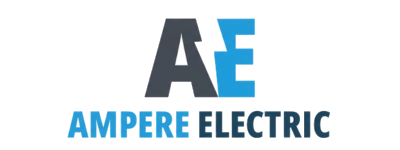

# Ampere Electric Website — Complete File Structure & Starter Files

## Final Folder Structure

```text
ampere-electric-website/
│
├── index.html
├── about.html
├── products.html
├── services.html
├── contact.html
├── privacy-policy.html
├── thank-you.html
│
├── assets/
│   │
│   ├── css/
│   │   ├── style.css
│   │   ├── responsive.css
│   │   └── animations.css
│   │
│   ├── js/
│   │   ├── main.js
│   │   ├── form.js
│   │   └── animation.js
│   │
│   ├── images/
│   │   ├── logo/
│   │   │   ├── logo-main.png
│   │   │   ├── logo-white.png
│   │   │   └── favicon.png
│   │   │
│   │   ├── hero/
│   │   ├── products/
│   │   ├── services/
│   │   ├── gallery/
│   │   └── clients/
│   │
│   └── fonts/
│
├── sitemap.xml
├── robots.txt
├── manifest.json
└── README.md
```

---

# 1. about.html

```html
<!DOCTYPE html>
<html lang="en">
<head>
  <meta charset="UTF-8">
  <meta name="viewport" content="width=device-width, initial-scale=1.0">
  <title>About Us | Ampere Electric</title>

  <link rel="icon" href="assets/images/logo/favicon.png">

  <link rel="stylesheet" href="assets/css/style.css">
  <link rel="stylesheet" href="assets/css/responsive.css">
</head>
<body>

<header>
  <nav class="navbar">
    <a href="index.html" class="logo">
      
    </a>

    <ul class="nav-links">
      <li><a href="index.html">Home</a></li>
      <li><a href="about.html">About</a></li>
      <li><a href="products.html">Products</a></li>
      <li><a href="services.html">Services</a></li>
      <li><a href="contact.html">Contact</a></li>
    </ul>
  </nav>
</header>

<section class="page-hero">
  <div class="container">
    <h1>About Ampere Electric</h1>
    <p>Your trusted industrial electrical solutions partner.</p>
  </div>
</section>

<section class="section">
  <div class="container">
    <h2>Who We Are</h2>

    <p>
      Ampere Electric provides industrial electrical products,
      automation solutions, motors, transformers, drives,
      control panels and engineering services.
    </p>

    <p>
      We focus on quality, timely delivery,
      technical expertise and customer satisfaction.
    </p>
  </div>
</section>

<section class="section bg-light">
  <div class="container">
    <h2>Why Choose Us</h2>

    <div class="grid-3">
      <div class="card">
        <h3>Quality Products</h3>
        <p>Reliable industrial electrical equipment from trusted brands.</p>
      </div>

      <div class="card">
        <h3>Technical Expertise</h3>
        <p>Experienced professionals with industrial domain knowledge.</p>
      </div>

      <div class="card">
        <h3>Customer Support</h3>
        <p>Fast response and dependable after-sales support.</p>
      </div>
    </div>
  </div>
</section>

<footer class="footer">
  <div class="container">
    <p>© 2026 Ampere Electric. All Rights Reserved.</p>
  </div>
</footer>

<script src="assets/js/main.js"></script>
</body>
</html>
```

---

# 2. products.html

```html
<!DOCTYPE html>
<html lang="en">
<head>
  <meta charset="UTF-8">
  <meta name="viewport" content="width=device-width, initial-scale=1.0">
  <title>Products | Ampere Electric</title>

  <link rel="stylesheet" href="assets/css/style.css">
  <link rel="stylesheet" href="assets/css/responsive.css">
</head>
<body>

<header>
  <nav class="navbar">
    <a href="index.html" class="logo">
      
    </a>
  </nav>
</header>

<section class="page-hero">
  <div class="container">
    <h1>Our Products</h1>
  </div>
</section>

<section class="section">
  <div class="container grid-3">

    <div class="card">
      <h3>Industrial Motors</h3>
      <p>High performance HT & LT motors.</p>
    </div>

    <div class="card">
      <h3>Transformers</h3>
      <p>Reliable industrial transformers.</p>
    </div>

    <div class="card">
      <h3>VFD Drives</h3>
      <p>Energy efficient drive solutions.</p>
    </div>

    <div class="card">
      <h3>Control Panels</h3>
      <p>Customized industrial panels.</p>
    </div>

    <div class="card">
      <h3>Switchgear</h3>
      <p>Industrial switchgear solutions.</p>
    </div>

    <div class="card">
      <h3>Industrial Fans</h3>
      <p>Heavy duty industrial ventilation systems.</p>
    </div>

  </div>
</section>

<footer class="footer">
  <div class="container">
    <p>© 2026 Ampere Electric.</p>
  </div>
</footer>

</body>
</html>
```

---

# 3. services.html

```html
<!DOCTYPE html>
<html lang="en">
<head>
  <meta charset="UTF-8">
  <meta name="viewport" content="width=device-width, initial-scale=1.0">
  <title>Services | Ampere Electric</title>

  <link rel="stylesheet" href="assets/css/style.css">
  <link rel="stylesheet" href="assets/css/responsive.css">
</head>
<body>

<section class="page-hero">
  <div class="container">
    <h1>Our Services</h1>
  </div>
</section>

<section class="section">
  <div class="container grid-3">

    <div class="card">
      <h3>Installation</h3>
      <p>Industrial equipment installation services.</p>
    </div>

    <div class="card">
      <h3>Testing & Commissioning</h3>
      <p>Reliable commissioning support.</p>
    </div>

    <div class="card">
      <h3>AMC Services</h3>
      <p>Annual maintenance contracts.</p>
    </div>

    <div class="card">
      <h3>Automation Solutions</h3>
      <p>Industrial automation integration.</p>
    </div>

    <div class="card">
      <h3>Consultancy</h3>
      <p>Electrical engineering consultancy services.</p>
    </div>

    <div class="card">
      <h3>After Sales Support</h3>
      <p>Dedicated customer assistance.</p>
    </div>

  </div>
</section>

</body>
</html>
```

---

# 4. contact.html

```html
<!DOCTYPE html>
<html lang="en">
<head>
  <meta charset="UTF-8">
  <meta name="viewport" content="width=device-width, initial-scale=1.0">
  <title>Contact Us | Ampere Electric</title>

  <link rel="stylesheet" href="assets/css/style.css">
</head>
<body>

<section class="page-hero">
  <div class="container">
    <h1>Contact Us</h1>
  </div>
</section>

<section class="section">
  <div class="container">

    <form id="contactForm">

      <input type="text" name="name" placeholder="Your Name" required>

      <input type="email" name="email" placeholder="Your Email" required>

      <input type="tel" name="phone" placeholder="Phone Number">

      <textarea name="message" rows="5" placeholder="Your Requirement"></textarea>

      <button type="submit" class="btn-primary">
        Submit Inquiry
      </button>

    </form>

  </div>
</section>

<script src="assets/js/form.js"></script>
</body>
</html>
```

---

# 5. privacy-policy.html

```html
<!DOCTYPE html>
<html lang="en">
<head>
  <meta charset="UTF-8">
  <meta name="viewport" content="width=device-width, initial-scale=1.0">
  <title>Privacy Policy | Ampere Electric</title>

  <link rel="stylesheet" href="assets/css/style.css">
</head>
<body>

<section class="section">
  <div class="container">

    <h1>Privacy Policy</h1>

    <p>
      Ampere Electric respects your privacy.
      We do not sell or misuse customer information.
    </p>

    <p>
      Information submitted through contact forms
      is used only for business communication.
    </p>

  </div>
</section>

</body>
</html>
```

---

# 6. thank-you.html

```html
<!DOCTYPE html>
<html lang="en">
<head>
  <meta charset="UTF-8">
  <meta name="viewport" content="width=device-width, initial-scale=1.0">
  <title>Thank You | Ampere Electric</title>

  <link rel="stylesheet" href="assets/css/style.css">
</head>
<body>

<section class="section center">
  <div class="container">

    <h1>Thank You!</h1>

    <p>
      Your inquiry has been submitted successfully.
      Our team will contact you shortly.
    </p>

    <a href="index.html" class="btn-primary">
      Back to Home
    </a>

  </div>
</section>

</body>
</html>
```

---

# 7. assets/css/style.css

```css
:root {
  --primary: #0ea5e9;
  --secondary: #1e293b;
  --light: #f8fafc;
  --dark: #0f172a;
  --white: #ffffff;
}

* {
  margin: 0;
  padding: 0;
  box-sizing: border-box;
}

body {
  font-family: Arial, sans-serif;
  line-height: 1.6;
  color: var(--secondary);
}

.container {
  width: 90%;
  max-width: 1200px;
  margin: auto;
}

.section {
  padding: 80px 0;
}

.bg-light {
  background: #f1f5f9;
}

.navbar {
  display: flex;
  justify-content: space-between;
  align-items: center;
  padding: 20px 0;
}

.logo img {
  height: 70px;
}

.nav-links {
  display: flex;
  list-style: none;
  gap: 20px;
}

.nav-links a {
  text-decoration: none;
  color: var(--secondary);
  font-weight: 600;
}

.page-hero {
  background: linear-gradient(to right, #0ea5e9, #1e293b);
  color: white;
  padding: 100px 0;
  text-align: center;
}

.grid-3 {
  display: grid;
  grid-template-columns: repeat(3, 1fr);
  gap: 30px;
}

.card {
  background: white;
  padding: 30px;
  border-radius: 12px;
  box-shadow: 0 4px 20px rgba(0,0,0,0.08);
}

.card h3 {
  margin-bottom: 15px;
}

.footer {
  background: var(--dark);
  color: white;
  text-align: center;
  padding: 30px 0;
}

form {
  display: flex;
  flex-direction: column;
  gap: 20px;
}

input,
textarea {
  padding: 14px;
  border: 1px solid #cbd5e1;
  border-radius: 8px;
}

.btn-primary {
  display: inline-block;
  background: var(--primary);
  color: white;
  padding: 14px 24px;
  border: none;
  border-radius: 8px;
  text-decoration: none;
  cursor: pointer;
}

.center {
  text-align: center;
}
```

---

# 8. assets/css/responsive.css

```css
@media(max-width: 960px) {

  .grid-3 {
    grid-template-columns: 1fr 1fr;
  }

}

@media(max-width: 768px) {

  .navbar {
    flex-direction: column;
    gap: 20px;
  }

  .nav-links {
    flex-direction: column;
    text-align: center;
  }

  .grid-3 {
    grid-template-columns: 1fr;
  }

  .logo img {
    height: 55px;
  }

}
```

---

# 9. assets/css/animations.css

```css
.fade-up {
  opacity: 0;
  transform: translateY(30px);
  transition: all 0.6s ease;
}

.fade-up.show {
  opacity: 1;
  transform: translateY(0);
}
```

---

# 10. assets/js/main.js

```javascript
window.addEventListener('scroll', () => {
  const navbar = document.querySelector('.navbar');

  if(window.scrollY > 50){
    navbar.classList.add('scrolled');
  } else {
    navbar.classList.remove('scrolled');
  }
});
```

---

# 11. assets/js/form.js

```javascript
const form = document.getElementById('contactForm');

form.addEventListener('submit', async (e) => {
  e.preventDefault();

  const formData = new FormData(form);

  const response = await fetch('https://api.web3forms.com/submit', {
    method: 'POST',
    body: formData
  });

  if(response.ok){
    window.location.href = 'thank-you.html';
  } else {
    alert('Something went wrong');
  }
});
```

---

# 12. assets/js/animation.js

```javascript
const fadeElements = document.querySelectorAll('.fade-up');

const observer = new IntersectionObserver(entries => {

  entries.forEach(entry => {

    if(entry.isIntersecting){
      entry.target.classList.add('show');
    }

  });

});

fadeElements.forEach(el => observer.observe(el));
```

---

# 13. robots.txt

```txt
User-agent: *
Allow: /

Sitemap: https://ampereelectric.com/sitemap.xml
```

---

# 14. sitemap.xml

```xml
<?xml version="1.0" encoding="UTF-8"?>
<urlset xmlns="http://www.sitemaps.org/schemas/sitemap/0.9">

<url>
<loc>https://ampereelectric.com/</loc>
</url>

<url>
<loc>https://ampereelectric.com/about.html</loc>
</url>

<url>
<loc>https://ampereelectric.com/products.html</loc>
</url>

<url>
<loc>https://ampereelectric.com/services.html</loc>
</url>

<url>
<loc>https://ampereelectric.com/contact.html</loc>
</url>

</urlset>
```

---

# 15. manifest.json

```json
{
  "name": "Ampere Electric",
  "short_name": "Ampere",
  "start_url": "/",
  "display": "standalone",
  "background_color": "#ffffff",
  "theme_color": "#0ea5e9",
  "icons": [
    {
      "src": "assets/images/logo/favicon.png",
      "sizes": "192x192",
      "type": "image/png"
    }
  ]
}
```

---

# 16. README.md

```md
# Ampere Electric Website

Static industrial business website hosted on Cloudflare Pages.

## Tech Stack

- HTML5
- CSS3
- JavaScript
- Cloudflare Pages

## Deployment

1. Push code to GitHub
2. Connect repository in Cloudflare Pages
3. Deploy website

## Build Settings

Build command: Leave Empty
Build output directory: /

## Contact Form

Integrated using Web3Forms.
```

---

# Final Notes

## Replace Placeholder Domain

Replace:

```text
https://ampereelectric.com
```

with your actual domain.

---

## Add Web3Forms Access Key

Inside contact form:

```html
<input type="hidden" name="access_key" value="YOUR_ACCESS_KEY">
```

---

## Recommended Next Steps

1. Add actual product images
2. Add Google Maps iframe
3. Add OEM client logos
4. Add WhatsApp floating button
5. Optimize images to WebP
6. Deploy on Cloudflare Pages
